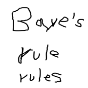
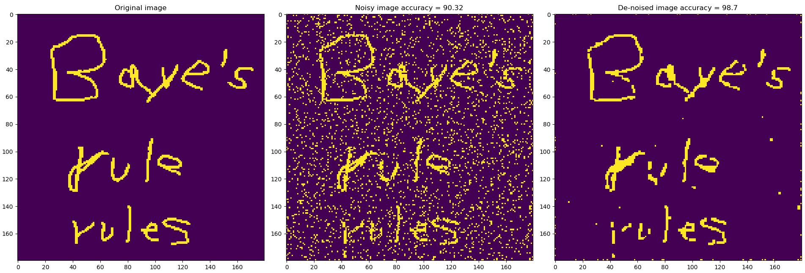

<button onclick="window.location.href = 'https://davidrmh.github.io';" id="home-button" title="Go to top">Take me home!</button>


```{r setup, include=FALSE}

knitr::opts_chunk$set(echo = TRUE)
```

# Introduction

In this post I'll show you how to de-noise images using a technique called *iterated conditional modes* or *ICM*.

This technique is illustrated as a simple use case of undirected graphical models, I'm taking as reference the (**really awesome**) book *Pattern Recognition and Machine Learning* by Christopher M. Bishop^[Freely available at https://www.microsoft.com/en-us/research/people/cmbishop/prml-book/](BPRML from now on) there you can find more details (section 8.3.3).

# Iterated conditional modes

Now, suppose that what we actually observe is a noisy version of the original image, that is, each original pixel is flipped (a change in the sign) with certain probability, say $10\%$.

Let's denote the noisy observation for pixel $(i,j)$ as $y_{ij} \in \{-1, +1 \}$, our objective is to find an image $\mathbf{x} = \{x_{ij}\}_{ij}$ that has less noise than the observed noisy image $\mathbf{y} = \{y_{ij}\}_{ij}$ and thus a better representation of the unknown noise-free image.

In [BPRML] a <a href="https://en.wikipedia.org/wiki/Markov_random_field">Markov Random Field</a> is used to model the problem which is then reduced to the **minimization** of the following *energy function* for each pixel $x_{ij}$.

$$
E(x_{ij}; \mathbf{x}, \mathbf{y}) = h \sum_{pq}x_{pq} - \beta \sum_{x \in neigh(x_{ij})}x x_{ij} - \eta \sum_{pq}x_{pq}y_{pq}
$$
where $\mathbf{x}$ is the current state of the de-noised image, $\mathbf{y}$ is the noisy image, $neigh(x_{ij})$ is the set with the neighbors of pixel $x_{ij}$, $neigh(x_{ij}) = \{x_{i,j-1}, x_{i,j+1}, x_{i-1,j}, x_{i+1,j}\}$. The parameters $\beta, \text{ and } \eta$ are positive constants and $h$ is a real number.

## Understanding the energy function

In order to grasp the ideas behind the energy function let's consider first the term $\eta x_{ij}y_{ij}$.

**Under the assumption that the noise level is small**, the value of  $y_{ij}$ is likely to be the same as in the original image and hence if the signs of $x_{ij}$ and $y_{ij}$ are different, then $-\eta x_{ij}y_{ij} > 0$ thus increasing the energy.

The term 
$$
\beta \sum_{x \in neigh(x_{ij})}x x_{ij}
$$

arises from the fact that, in an image, neighboring pixels are strongly correlated. 

Suppose that $x_{ij} = 1$ and all the neighbors are equal to $-1$, then

$$
-\beta \sum_{x \in neigh(x_{ij})}x x_{ij} > 0
$$

which causes an increase in the energy, so in this case a better choice would be $x_{ij} = -1$, decreasing $E(x_{ij}; \mathbf{x}, \mathbf{y})$.

Finally, the term $h \sum_{pq} x_{pq}$ biases the model towards pixel values that have one particular sign in preference to the other, if $\beta > 0$ then pixels with value $-1$ are preferred, similarly if $\beta <0$ pixels with value $+1$ are favored.

## Algorithm

The algorithm for iterated conditional modes is the following:

1. Initialize each pixel $x_{ij}$ by setting $x_{ij} = y_{ij}$.

2. Take randomly a pixel $x_{ij}$ and evaluate the energy in both cases when $x_{ij} = 1$ and $x_{ij} = -1$.

3. Keep the value of $x_{ij}$ that corresponds to the state with the lowest energy.

4. Repeat steps 2 and 3 until an arbitrary termination criteria.

# Implementation

<a href="image_denoising.py"><b>Download complete code</b></a>

In order to apply *ICM*, each pixel in the image must take a value from the set $\{-1, +1 \}$, i.e., it should be a binary image.

So, the first thing we need to do is convert an arbitrary image into a binary one. I prepared this $180 \times 180$ image (forgive my awful handwriting, I made the image using my mouse). <a href="bayes_180_180.png">Download image</a> 



In order to represent this image using a binary encoding you can use the following *python* code. In this case a value of $+1$ represents a stroke region and $-1$ background region.

```python
import imageio
import matplotlib.pyplot as plt
import numpy as np

#Original Image
img_orig = imageio.imread('bayes_180_180.png')

#Encodes the values to -1 or 1
#-1 is background
# 1 is drawing
img_orig_mod = -1*np.ones(shape = img_orig[:,:,0].shape)
img_orig_mod[img_orig[:,:,0] < img_orig[:,:,0].max() / 2] = 1
```

Next let's add some noise to the (binary) original image

```python
#Adds noise by flipping
#the pixels
np.random.seed(54321)
noise = 0.1
n_nodes = np.product(img_orig_mod.shape)
flips = np.random.choice([1,-1],
                         size = img_orig_mod.shape,
                         p =[1-noise, noise])
img_noisy = flips * img_orig_mod
```

For each pixel we can calculate its energy using this function

```python
def get_energy(img_noisy, img_den,
               h, beta, eta,
               row, col):
    '''
    Get's the energy for point x[row, col]
    in both scenarios x[row, col] = 1
    and x[row, col] = -1

    Parameters
    ----------
    img_noisy : 2d numpy array
        noisy image
        
    img_den : 2d numpy array
        Current state of the de-noised image
        
    h : float
    
    beta : positive float
        
    eta : positive float
        
    row : integer
        row of the pixel
        
    col : integer
        column of the pixel

    Returns
    -------
    list
        list[0] energy when x[row, col] = 1
        list[1] energy when x[row, col] = -1
    '''

    #Changes 1 pixel from the de-noised image
    img_den_1 = img_den.copy()
    img_den_1[row, col] = 1.
    
    img_den_m1 = img_den.copy()
    img_den_m1[row, col] = -1.
    
    energy_1 = h * np.sum(img_den_1)\
        - eta * np.sum(img_noisy * img_den_1)
    energy_m1 = h * np.sum(img_den_m1)\
        - eta * np.sum(img_noisy * img_den_m1)
    
    #Calculates the double sum
    #aux stores the neighbors
    #of node (row, col)
    aux = [img_den[row, col - 1], 
           img_den[row, col + 1],
           img_den[row - 1, col],
           img_den[row + 1, col]]
    
    doub_sum_1 = np.sum(aux)
    doub_sum_m1 = -1 * doub_sum_1
    
    energy_1 = energy_1 - beta * doub_sum_1
    energy_m1 = energy_m1 - beta * doub_sum_m1
    
    return [energy_1, energy_m1]
```

As termination criteria I'll use a specified number of iterations, in each one of them a number of pixels will be randomly selected and updated according to its energy.

Also, for simplicity, I just consider pixels with four neighbors, in other words, I do not consider pixels on the boundaries of the image.

```python
def ICM(img_noisy, h, beta, eta, n_iter = int(1e3),
        n_points = 178):
    '''
    De-noises a noisy image using
    Iterated conditional modes

    Parameters
    ----------
    img_noisy : 2d numpy array
        noisy image
        
    h : float
        
    beta : positive float
        
    eta : positive float
        
    n_iter : positive integer, optional
        Number of iterations. The default is int(1e3).
        
    n_points : positive integer, optional
        Number of pixels to be updated
        per iteration. The default is 178.

    Returns
    -------
    img_den : 2d numpy array
        De-noised image
    '''
    
    np.random.seed(54321)
    #image shape
    shape = img_noisy.shape
    
    #initializes the de-noised image
    img_den = img_noisy.copy()
    
    #applies iterated conditional modes
    #(coordinate-wise gradient ascent)
    #for a number of iterations
    for n in range(n_iter):
        
        #indexes of the pixels
        #to be updated
        idx_row = np.random.choice(range(1, shape[0] - 1),
                                   size = n_points,
                                   replace = False)
        
        idx_col = np.random.choice(range(1, shape[1] - 1),
                                   size = n_points,
                                   replace = False)
        
        idx_update = zip(idx_row, idx_col)
        
        for row, col in idx_update:
            
            #Calculates the energy
            #for pixel (row, col)
            energy = get_energy(img_noisy,
                                img_den,
                                h, beta, eta, row, col)
            e_1 = energy[0]
            e_m1 = energy[1]
            #Update image
            if e_1 <= e_m1:
                img_den[row, col] = 1.0
            else:
                img_den[row, col] = -1.0
                
    return img_den
```
Finally, we need some code to see the results

```python
def plot_images(img_noisy, img_orig,
                h=0, beta=1, eta=1,
                n_iter = 180*180,
                n_points = 2): 
    
    img_den = ICM(img_noisy, h = h,
                  beta = beta,
                  eta = eta,
                  n_iter = n_iter,
                  n_points = n_points)
    
    #Accuracy
    met_den = 100 * np.mean(img_den == img_orig)
    met_noi = 100 * np.mean(img_noisy == img_orig)
    
    #plot
    plt.clf()
    plt.subplot(211)
    plt.imshow(img_orig, vmin = -1, vmax = 1)
    plt.title(f'Original image')           
    
    plt.subplot(223)
    plt.imshow(img_noisy, vmin = -1, vmax = 1)
    plt.title(f'Noisy image accuracy = {round(met_noi,2)}')
    
    plt.subplot(224)
    plt.imshow(img_den, vmin = -1, vmax = 1)
    plt.title(f'De-noised image accuracy = {round(met_den,2)}')
    
    return img_den   
```

# Results

Using the following parameters we can obtain the image below (accuracy of $98.7\%$)

* Noise level $= 10\%$
* $h = 0$.

* $\beta = 1.0$.

* $\eta = 1.0$.

* Number of iterations  $= 1000$.

* Number of pixels per iteration $= 178$

On the left side is the noise-free image, in the center the noisy one and on the right the result of the de-noising procedure.



# Conclusions

As we can see, even when this is a very simple algorithm, it actually performs pretty well on **low noise images**.

Unfortunately, when the noise level is increased, the performance gets worse.

On the other side, this algorithm only works for images that can be encoded in a binary fashion.
